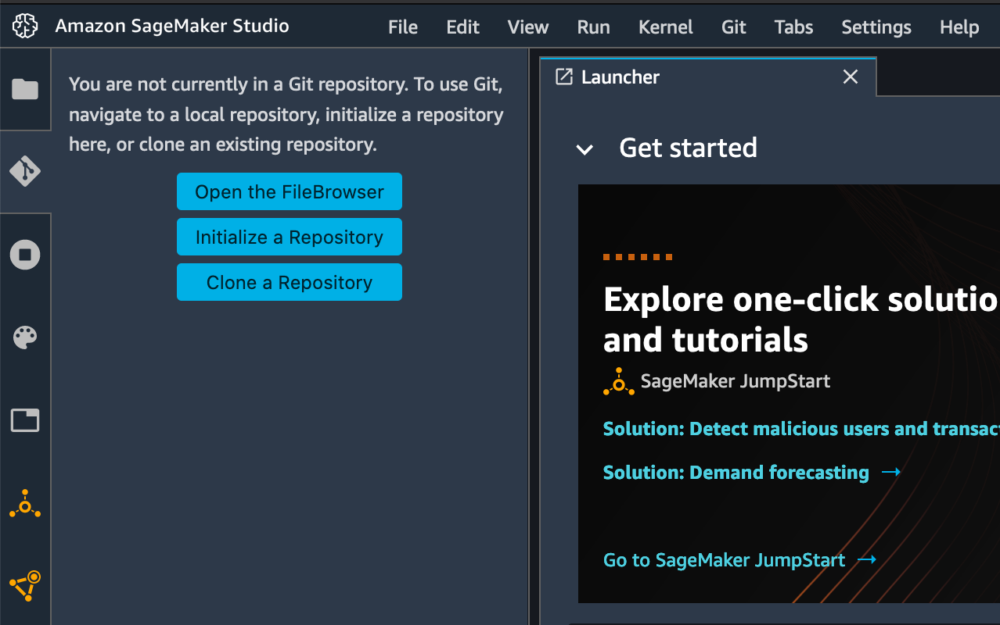

# Predict Bike Sharing Demand with AutoGluon

## Overview

This project's goal is to predict bike sharing demand using the AWS open-source AutoML library, AutoGluon. It focuses on leveraging AutoGluon's 'Tabular Prediction' to create accurate AutoML-based baseline models to predict the bike sharing demand using the Kaggle Bike Sharing demand dataset.

## Problem Overview

Bicycle sharing programs, also known as bike-sharing systems, provide a convenient and automated method for renting bicycles through a network of kiosk locations. This project addresses the challenge of predicting bike rental demand in the Washington D.C. Capital Bikeshare program using the Kaggle Bike Sharing demand dataset.

## Dataset
)](https://storage.googleapis.com/kaggle-media/competitions/kaggle/3948/media/bikes.png)<br>
[Kaggle Bike Sharing Demand Competition Dataset](https://www.kaggle.com/competitions/bike-sharing-demand/data)

## Approach

1. Downloaded and analyzed the dataset, focusing on identifying features and characteristics.
2. Trained a model using AutoGluon's Tabular Prediction with default settings for initial Kaggle ranking.
3. Conducted exploratory data analysis to understand feature impact and incorporated feature engineering for model enhancement.
4. Iteratively refined the model, utilizing feature-engineered datasets and fine-tuning hyperparameters to improve performance.

## Getting Started

### Resources
* Clone this template repository `git clone git@github.com:udacity/nd009t-c1-intro-to-ml-project-starter.git` into AWS Sagemaker Studio (or local development).




- Visit the [Kaggle Bike Sharing Demand Competition](https://www.kaggle.com/c/bike-sharing-demand) page for competition details.

### Dependencies

- Python 3.7
- pydantic 1.10.3
- MXNet 1.8
- Pandas >= 1.2.4
- AutoGluon 0.2.0 

### Installation
For this project, it is highly recommended to use Sagemaker Studio from the course provided AWS workspace. This will simplify much of the installation needed to get started.

For local development, you will need to setup a jupyter lab instance.
* Follow the [jupyter install](https://jupyter.org/install.html) link for best practices to install and start a jupyter lab instance.
* If you have a python virtual environment already installed you can just `pip` install it.
```
pip install jupyterlab
```
* There are also docker containers containing jupyter lab from [Jupyter Docker Stacks](https://jupyter-docker-stacks.readthedocs.io/en/latest/index.html).

## Project Specific Files

1. **`project_notebook-bike_sharing_demand.ipynb`**: Jupyter notebook with code and explanations 
2. **`project_notebook-bike_sharing_demand.html`**: HTML export of the Jupyter notebook
3. **`project_report.md`**: Markdown file of the report, providing insights into significant model improvement iterations

## Udacity's instructions for this project

1. Create an account with Kaggle.
2. Download the Kaggle dataset using the kaggle python library.
3. Train a model using AutoGluon’s Tabular Prediction and submit predictions to Kaggle for ranking.
4. Use Pandas to do some exploratory analysis and create a new feature, saving new versions of the train and test dataset.
5. Rerun the model and submit the new predictions for ranking.
6. Tune at least 3 different hyperparameters from AutoGluon and resubmit predictions to rank higher on Kaggle.
7. Write up a report on how improvements (or not) were made by either creating additional features or tuning hyperparameters, and why you think one or the other is the best approach to invest more time in.

## This was the first project of the "Udacity Machine Learning Fundamentals Nandegree" offered by AWS as part of the "AWS AI & ML scholarship"
Confirmation  link: [link](https://graduation.udacity.com/confirm/e/ba2b0610-ee8f-11ed-8e43-fbdc25fcc49f)


